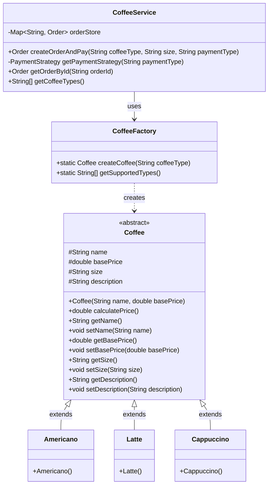
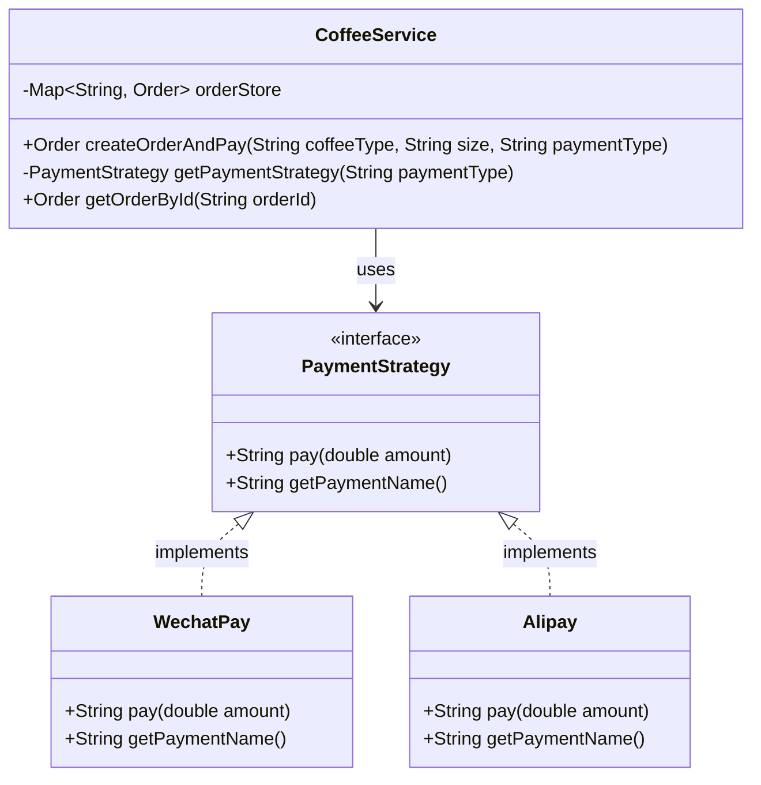
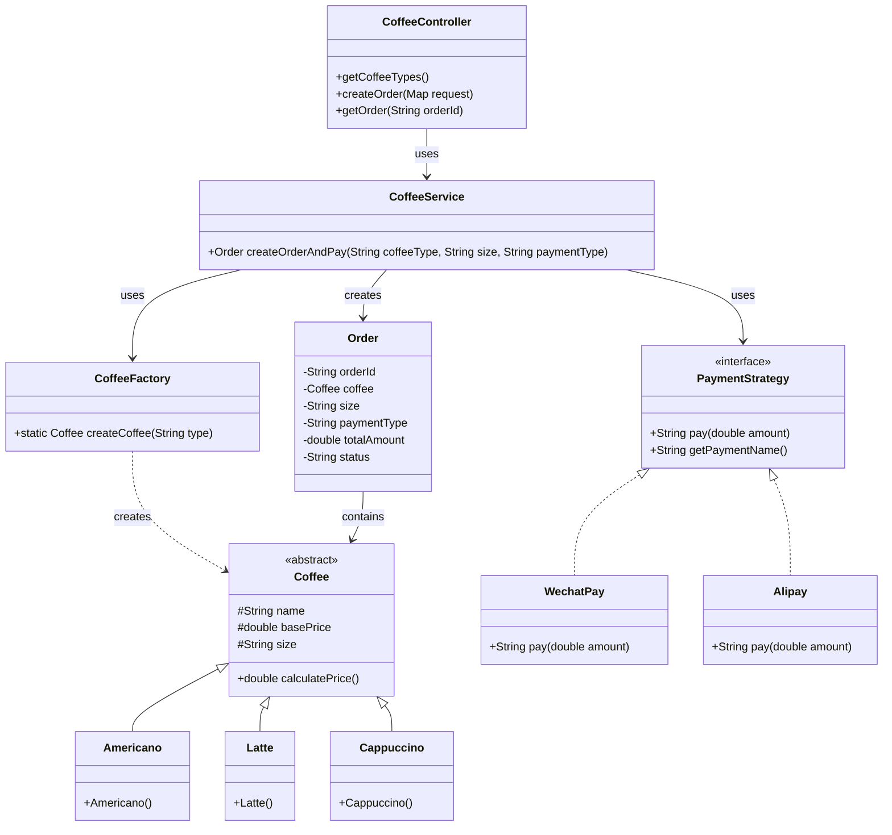
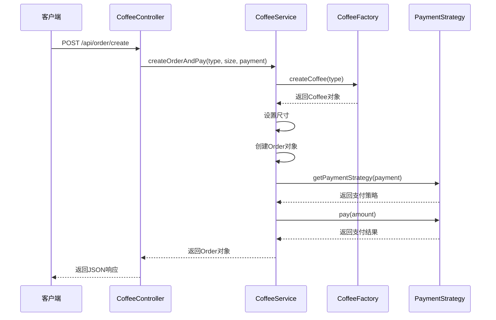

# UML类图绘制指南

## 📊 工厂模式类图

### 类图结构（Mermaid格式）



### 类图说明

**类的关系**:
1. **继承关系** (实线空心三角箭头): 
   - `Americano`、`Latte`、`Cappuccino` 继承自 `Coffee`

2. **依赖关系** (虚线箭头):
   - `CoffeeFactory` 创建 `Coffee` 对象
   - `CoffeeService` 使用 `CoffeeFactory`

**关键点**:
- `Coffee` 是抽象类（用<<abstract>>标记）
- `CoffeeFactory` 的 `createCoffee()` 方法是静态方法（下划线或static标记）
- 箭头方向表示依赖方向

---

## 📊 策略模式类图

### 类图结构（Mermaid格式）



### 类图说明

**类的关系**:
1. **实现关系** (虚线空心三角箭头):
   - `WechatPay` 和 `Alipay` 实现 `PaymentStrategy` 接口

2. **关联关系** (实线箭头):
   - `CoffeeService` 持有 `PaymentStrategy` 的引用

**关键点**:
- `PaymentStrategy` 是接口（用<<interface>>标记）
- 具体策略类都实现同一个接口
- `CoffeeService` 通过接口调用，不关心具体实现

---

## 🎨 综合类图（两个模式结合）



---

## 📝 手绘类图建议

如果你需要手绘或使用Visio/Draw.io等工具绘制，请遵循以下规范：

### 1. 类的表示
```
┌─────────────────────────┐
│      ClassName          │  ← 类名（粗体）
├─────────────────────────┤
│ - field: Type           │  ← 属性（-私有，#保护，+公有）
├─────────────────────────┤
│ + method(): ReturnType  │  ← 方法
└─────────────────────────┘
```

### 2. 关系的表示

**继承关系**（实线 + 空心三角箭头）:
```
子类 ──────────▷ 父类
```

**实现关系**（虚线 + 空心三角箭头）:
```
实现类 - - - - -▷ 接口
```

**依赖关系**（虚线 + 普通箭头）:
```
类A - - - - -> 类B
```

**关联关系**（实线 + 普通箭头）:
```
类A ────────> 类B
```

### 3. 可见性符号
- `+` public（公有）
- `-` private（私有）
- `#` protected（保护）
- `~` default（默认）

### 4. 特殊标记
- 抽象类：类名用*斜体*或标注 `<<abstract>>`
- 接口：标注 `<<interface>>`
- 静态方法：方法名用<u>下划线</u>或标注 `static`

---

## 🛠️ 推荐绘图工具

### 在线工具
1. **Draw.io (diagrams.net)** - 免费，功能强大
   - 网址: https://app.diagrams.net/
   - 支持导出为PNG、SVG、PDF

2. **PlantUML** - 代码生成类图
   - 网址: https://plantuml.com/
   - 可以用文本描述生成类图

3. **Mermaid Live Editor** - 实时预览
   - 网址: https://mermaid.live/
   - 支持Mermaid语法

### 桌面工具
1. **Visual Paradigm** - 专业UML工具
2. **StarUML** - 轻量级UML工具
3. **Microsoft Visio** - 微软官方工具

---

## 💡 实验报告中的类图建议

### 必绘类图
1. **工厂模式类图** - 展示Coffee及其子类和CoffeeFactory的关系
2. **策略模式类图** - 展示PaymentStrategy接口及其实现类

### 可选类图
3. **综合类图** - 展示整个系统的架构
4. **时序图** - 展示订单创建的流程

### 时序图示例（订单创建流程）



---

## 📋 类图检查清单

在提交实验报告前，请检查类图是否包含：

- [ ] 所有相关的类都已绘制
- [ ] 类的属性和方法完整
- [ ] 关系线条正确（继承、实现、依赖、关联）
- [ ] 箭头方向正确
- [ ] 可见性符号正确（+、-、#）
- [ ] 抽象类和接口有明确标记
- [ ] 类图清晰易读
- [ ] 有必要的文字说明

---

## 🎯 评分要点

老师在看类图时通常会关注：

1. **正确性** (40%)
   - 类之间的关系是否正确
   - 是否符合设计模式的定义

2. **完整性** (30%)
   - 是否包含所有重要的类
   - 是否展示了关键的属性和方法

3. **规范性** (20%)
   - 是否符合UML规范
   - 符号使用是否正确

4. **美观性** (10%)
   - 布局是否合理
   - 是否清晰易读

---

**祝你绘制出优秀的UML类图！📊✨**
